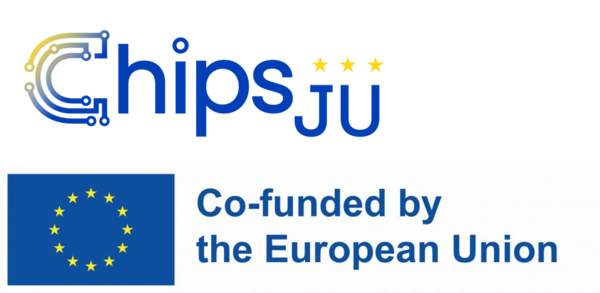

# PhaseBases

Part of the [Phase.jl](https://github.com/JuliaPhase/Phase.jl) ecosystem.

<!-- DOI badge: add after first Zenodo release -->

> **Work in progress:** the API may still change.

PhaseBases.jl provides basis representations for optical phase aberrations: bases such as Zernike polynomials, pixel bases and user-defined function sets (for example Gaussian bumps), together with the phase types and routines to compose and decompose wavefronts in them.

The package is designed for iterative algorithms (such as phase retrieval), where different combinations of basis functions are evaluated many times.
For this purpose, the basis functions are precalculated on a fixed grid and kept for fast access.

## Funding

This work has received funding from the ECSEL Joint Undertaking (JU) under grant agreement No 826589 (MADEin4). The JU receives support from the European Union's Horizon 2020 research and innovation programme and France, Germany, Austria, Italy, Sweden, Netherlands, Belgium, Hungary, Romania and Israel.

This work is part of the 14AMI project (grant agreement No 101111948). The project is supported by the Chips Joint Undertaking and its members including the top-up funding by RVO (The Netherlands Enterprise Agency).

